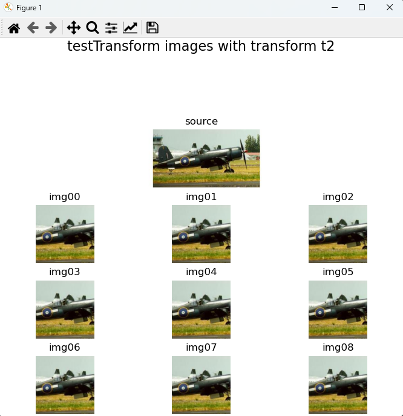
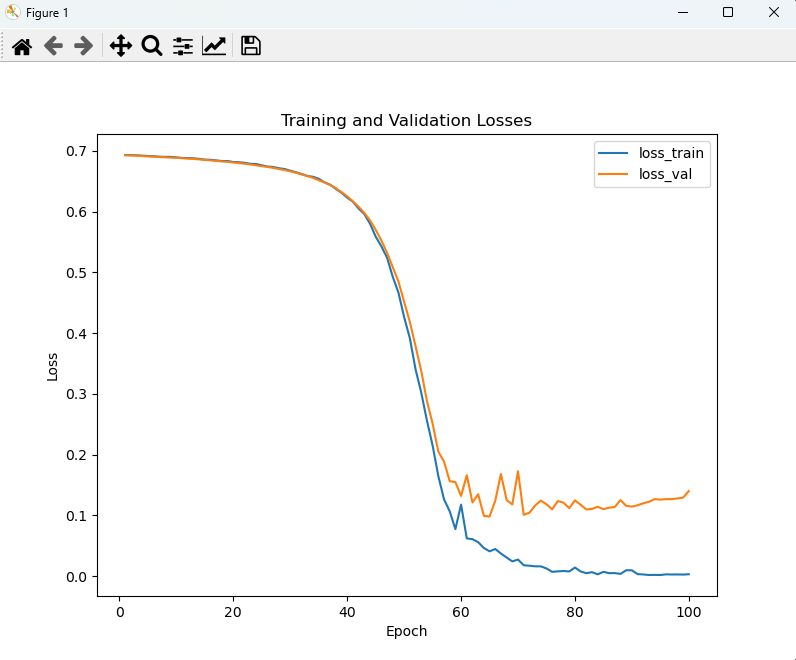
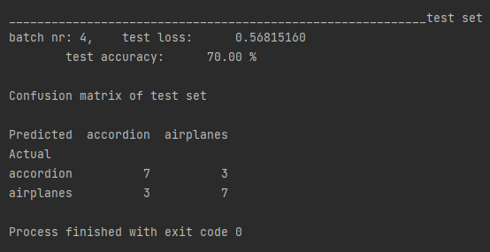

# Simple-ImageClassification-using-Pytorch

**Luuk van Waveren - April 2023**

Machinelearning is a hot topic. As an introduction to machinelearning i made a neural network during my college education.  
This is my python implemention using pytorch that learns to perform simple image classification using an image set from Caltech Data.

The script uses the images to create a dataset, starts learning to correctly classify as to what each image is and shows how good it does this at the end.  
During training it alters the weights of the neural network to steer towards better performance.  
During validation it doesn't change the weights and it serves purely as a check to see if the neural networks increase in performance is universal.

Follow these steps to use the script:
- [Download](https://data.caltech.edu/records/mzrjq-6wc02) the Caltech 101 images from Caltech
- Unpack this folder including its subfolders and insert folders "101_ObjectCategories" and "Annotations" in the "Images" folder
- install missing modules (a text file with the modules is included)
- change learning parameters inside the [input](IC_Input.py) file (if specific classes are desired, enter a list of indices in i_class)
- run the [main](IC_main.py) file to start the script


## Example: 2 classes of images

_Input:_
```
n_Class = 2,  
batch_size = 5, 
epochs = 60, 
lr = 0.0008, 
momentum = 0.9
```

<br/><br/>
**Step 1: DataSets are created for "accordion" and "airplanes":**


The images are transformed before they are used for training and validation. Left shows transformation for training and right for validation.
The validation images are kept as close to the original as possible.

<p float="left">
    
    
</p>

<br/><br/>
**Step 2: Learning and validating:**

each epoch the classification of the neural network is measured on the training and the validation datasets


The validation performance at the end of training is 90%


the graph shows that the neural network started overfitting at around epoch 57.
From this point on further training is less effective.



<br/><br/>
**Step 3: The final test:**

the final test classification performance is 95%, so the neural network correctly classifies 95% of the images.
This can also be seen in the confusion matrix, where only 1 of the 20 images was wrongly classified.

